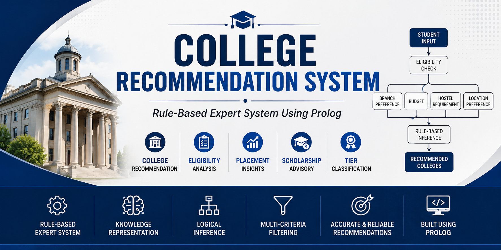
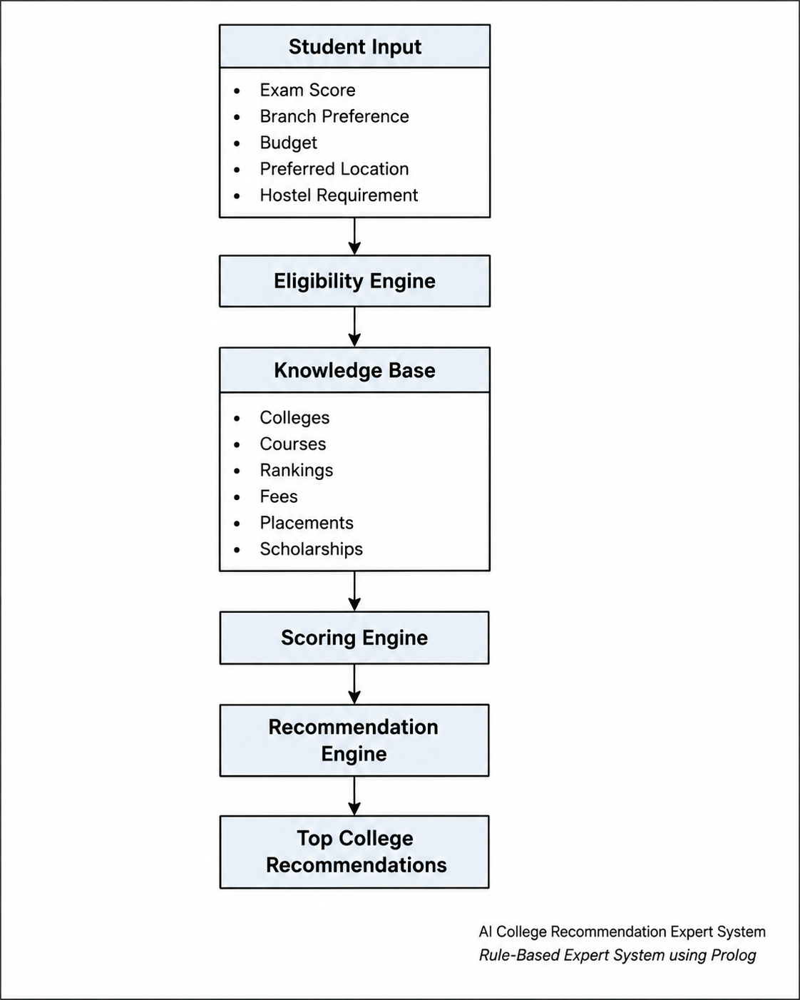
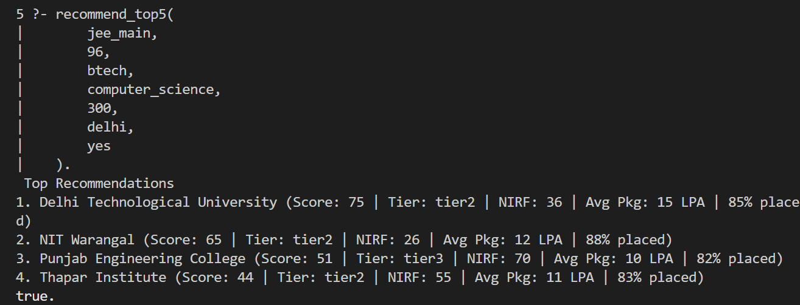
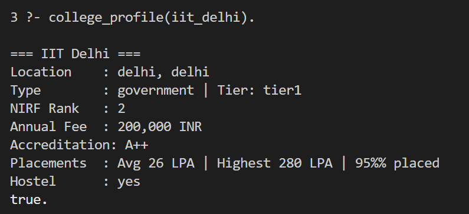
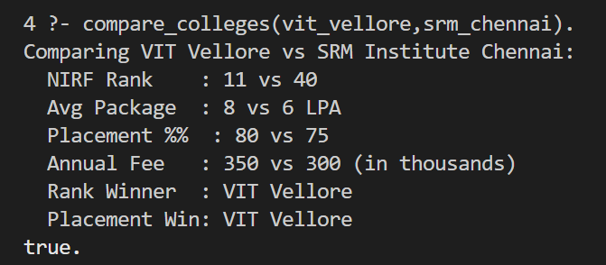
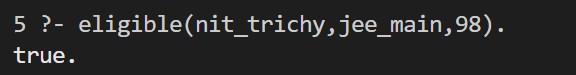
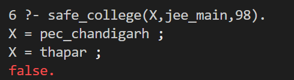

<p align="center">
  
</p>

# AI College Recommendation Expert System

A rule-based expert system built in Prolog for personalized college recommendation and decision support.

## Overview
The AI College Recommendation Expert System is a Prolog-based expert system that provides personalized college recommendations using eligibility rules, placement statistics, rankings, fees, scholarships, and student preferences. It applies rule-based reasoning and scoring mechanisms to support informed college selection.
---

## Key Features

- Personalized college recommendations
- Eligibility verification based on exam scores
- Tier classification of colleges
- College comparison and advisory support
- Placement, ranking, and fee analysis
- Scholarship and hostel availability filtering
- Safe and stretch college identification

---
## System Architecture



## Tech Stack

- SWI-Prolog
- Logic Programming
- Rule-Based Expert System
- Knowledge Representation

## Project Structure

```text
AI-College-Recommendation-Expert-System
│
├── src/
│   ├── knowledge_base.pl
│   ├── utility_predicates.pl
│   ├── eligibility_rules.pl
│   ├── scoring_engine.pl
│   ├── recommendation_engine.pl
│   ├── advisory_rules.pl
│   └── main.pl
│
├── docs/
│   ├── diagrams/
│   │   └── system_architecture.png
│   │
│   ├── screenshots/
│   │   ├── top_recommendations.png
│   │   ├── college_profile.png
│   │   ├── college_comparison.png
│   │   ├── tier_classification.png
│   │   └── safe_colleges.png
│   │
│   └── report/
│       └── Project_Report.pdf
│
├── sample_queries/
│   └── test_queries.txt
│
├── assets/
│
├── README.md
├── LICENSE
```

## How to Run

1. Install SWI-Prolog
2. Open the project directory
3. Navigate to the src folder
4. Start SWI-Prolog

```prolog
[main].
```

5. Execute sample queries

```prolog
recommend_top5(
    jee_main,
    96,
    btech,
    computer_science,
    300,
    delhi,
    yes
).
```

## Screenshots

### Top Recommendations



### College Profile



### College Comparison


### Tier Classification



### Safe Colleges




---

## Future Enhancements

- Web-based user interface
- Dynamic college data integration
- Machine learning assisted recommendations
---

## Author

Avinash Madkatte

MCA Candidate, Jawaharlal Nehru University (JNU)

